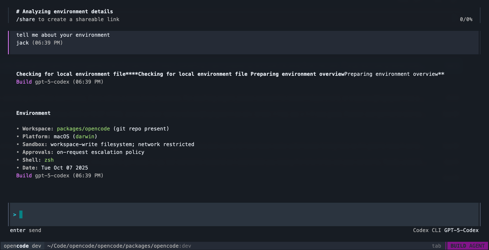

# opencode-codex-provider

`opencode-codex-provider` is an external plugin that lets the open-source **opencode** CLI run against the Codex MCP server that ships with OpenAI’s ChatGPT desktop apps. The plugin is intentionally small: it keeps the Codex-specific streaming logic out of the upstream opencode tree while still delivering a first-class streaming experience and minimal setup cost for users with a ChatGPT Pro subscription.

---

## What problem does it solve?

Opencode’s core distribution targets API-model providers (OpenAI, Anthropic, Bedrock, etc.). ChatGPT Pro customers, however, already have access to the Codex MCP server through the ChatGPT desktop app and its `codex` CLI binary. Using that local server is attractive because:

- **Zero extra API fees:** traffic stays inside the ChatGPT plan you already pay for.
- **Lower latency & richer events:** the MCP server emits fine-grained notifications (agent messages, reasoning deltas, command output) that the stock opencode provider never surfaced.
- **Tooling parity:** you get the same sand-boxing, approvals, and CLI automation that opencode already exposes for other LLMs.

This repo delivers exactly that by:

1. Shipping a drop-in `createCodexProvider()` implementation that wraps the MCP server and streams every event.
2. Providing a one-line plugin hook so opencode can dynamically import that provider instead of the stock “SDK loader.”
3. Supplying a tiny patch (`codex-provider-core.patch`) that teaches opencode’s provider subsystem how to defer to custom factories when requested.

---

## How it works (high level)

1. **Plugin registration (`index.ts`)**  
   When opencode boots, it enumerates plugins listed in `opencode.json`. This plugin’s `CodexProviderPlugin` keeps the existing provider metadata (names, models, options) but also sets `providerFactory: "opencode-codex-provider/provider"`. That single option is the “escape hatch” our patch looks for.

2. **Core patch (`codex-provider-core.patch`)**  
   The patch alters `packages/opencode/src/provider/provider.ts#getModel`. Before invoking the normal SDK loader, it checks whether `provider.options.providerFactory` exists. If it does, opencode dynamically imports the module and expects it to expose `createCodexProvider`. That returned factory receives all subsequent language-model calls. No other providers are touched, and the fallback path remains unchanged.

3. **Custom provider (`src/codexProvider.ts`)**  
   This is a TypeScript port of the Codex streaming logic. Notable responsibilities:
   - Spawns the `codex` CLI MCP server and speaks JSON-RPC.
   - Streams `agent_message_delta`, `agent_reasoning_delta`, `exec_command_output_delta`, and `task_complete` events in real time.
   - Provides command-output filtering, reasoning dedupe, and error handling consistent with the upstream CLI.
   - Keeps the implementation self-contained so updating opencode doesn’t require touching these files.

4. **Setup script (`setup-codex-provider.sh`)**  
   Because the upstream repo has no first-class hook yet, we ship a script that:
   - Applies the one-hunk patch to the checked-out `opencode` repository.
   - Adds `"file:<workspace>/opencode-codex-provider"` as a local Bun dependency of `packages/opencode`.
   - Ensures the workspace `opencode.json` contains `"opencode-codex-provider"` in the `plugin` array.
   The script is idempotent—it skips the patch if already applied and quietly relinks the package.

---

## Repository layout

```
opencode-codex-provider/
├── codex-provider-core.patch      # single-hunk core hook that adds providerFactory support
├── index.ts                       # plugin entry that registers models & providerFactory
├── package.json                   # Bun/TypeScript metadata (exports both plugin + provider)
├── setup-codex-provider.sh        # helper script to patch/link the main opencode repo
└── src/
    ├── codexClient.ts             # JSON-RPC MCP client + notification plumbing
    ├── codexProvider.ts           # LanguageModel implementation with streaming glue
    ├── logger.ts                  # lightweight debug logger (no opencode imports required)
    ├── types.ts                   # shared JSON-RPC and provider option types
    └── utils.ts                   # message extraction & option mappers
```

Expected workspace layout:

```
<workspace>/opencode                    # upstream opencode repo
<workspace>/opencode-codex-provider     # this plugin repo
```

---

## Quick start

1. **Install opencode deps (if necessary)**

   ```bash
   cd <workspace>/opencode
   bun install
   ```

2. **Apply patch & link provider**

   ```bash
   cd <workspace>/opencode-codex-provider
   ./setup-codex-provider.sh
   ```

   The script will:
   - Patch `packages/opencode/src/provider/provider.ts` so it recognizes `providerFactory`.
   - Add this repo as a local dependency (`file:<workspace>/opencode-codex-provider`).
   - Append `"opencode-codex-provider"` to `<workspace>/opencode.json`’s `plugin` list.

3. **Verify streaming works**

   ```bash
   cd <workspace>/opencode/opencode
   bun run dev --print-logs --log-level DEBUG run "hello"
   ```

   Look for:
   - Log entries like `providerID=codex source=custom-factory`.
   - `[opencode-codex-provider]` debug lines showing MCP notifications.
   - Live `agent_message_delta` and reasoning deltas in the CLI output.

   

---

## Updating / reapplying

Whenever you pull a new version of `opencode` or reset the repo:

```bash
cd <workspace>/opencode-codex-provider
./setup-codex-provider.sh
```

The script is safe to rerun; it only re-applies the patch if necessary and relinks the local package.

---

## Removing the integration

1. In `opencode`, revert the patched file:

   ```bash
   cd <workspace>/opencode/opencode
   git checkout -- packages/opencode/src/provider/provider.ts
   ```

2. Optionally remove the local dependency and delete `"opencode-codex-provider"` from `<workspace>/opencode.json`.

No other files are touched.

---

## Limitations & considerations

- This is intentionally a short-term “bridge” until opencode grows a first-class provider extension mechanism. Expect to re-run the setup script after upgrading opencode.
- The Codex MCP server comes from the ChatGPT desktop app: make sure the `codex` CLI is installed and on your path.
- The plugin defaults to streaming reasoning and command output. Tweak `streamReasoning`, `streamCommandOutput`, or `includeMessageSource` in opencode’s provider options if you need different behaviour.
- Treat the patch as a lightweight override, not a permanent fork. Keep an eye on upstream changes to `provider.ts` so re-applying stays trivial.

---

## License

Unless otherwise noted, this repository follows the same license terms as the upstream opencode project.
